# crossplane-aws-azure
[](https://github.com/jonashackt/crossplane-aws-azure/actions/workflows/provision-aws.yml)
[](https://github.com/jonashackt/crossplane-aws-azure/actions/workflows/provision-azure.yml)

)
)
[](https://github.com/jonashackt/crossplane-aws-azure/blob/master/LICENSE)
[](https://renovatebot.com)

Example project showing how to get started with Crossplane, connect it to multiple providers like AWS, Azure - and provision some resources like a S3Bucket or a StorageAccount through K8s CRDs

> This repo is accompanied by this blog post https://blog.codecentric.de/en/2022/07/crossplane/

Also it is used as an example in these three [iX Magazin](https://www.heise.de/ix/) issues (simply click on the magazine covers to access the full articles):

[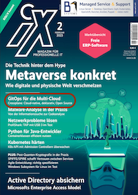](https://www.codecentric.de/wissens-hub/fachmedien/crossplane-gitops-fuer-die-multi-cloud) [](https://www.codecentric.de/wissen/publikation/crossplane-provisionierung-in-aws-und-azure) 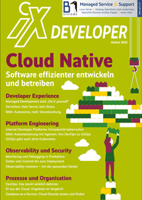

Crossplane https://crossplane.io/ claims to be the "The cloud native control plane framework". It introduces a new way how to manage any cloud resource (beeing it Kubernetes-native or not). It's an alternative Infrastructure-as-Code tooling to Terraform, AWS CDK/Bicep or Pulumi and introduces a higher level of abstraction - based on Kubernetes CRDs. 

Literally the best intro post to Crossplane for me was https://blog.crossplane.io/crossplane-vs-cloud-infrastructure-addons/ - here the real key benefits especially compared to other tools are described. Without marketing blabla. If you love deep dives, I can also recommend Nate Reid's blog https://vrelevant.net/ who works as Staff Solutions Engineer at Upbound.


# Crossplane basic concepts

https://crossplane.io/docs/v1.8/concepts/overview.html

* [Managed Resourced (MR)](https://crossplane.io/docs/v1.8/concepts/managed-resources.html): Kubernetes custom resources (CRDs) that represent infrastructure primitives (mostly in cloud providers). All Crossplane Managed Resources could be found via https://doc.crds.dev/ 
* [Composite Resources (XR)](https://crossplane.io/docs/v1.8/concepts/composition.html): compose Managed Resources into higher level infrastructure units (especially interesting for platform teams). They are defined by:
    * a `CompositeResourceDefinition` (XRD) (which defines an OpenAPI schema the `Composition` needs to be conform to)
    * (optional) `CompositeResourceClaims` (XRC) (which is an abstraction of the XR for the application team to consume) - but is fantastic to hold the exact configuration parameters for the concrete resources you want to provision
    * a `Composition` that describes the actual infrastructure primitives aka `Managed Resources` used to build the Composite Resource. One XRD could have multiple Compositions - e.g. to one for every environment like development, stating and production
    * and configured by a `Configuration`
* [Packages](https://crossplane.io/docs/v1.8/concepts/packages.html): OCI container images to handle distribution, version updates, dependency management & permissions for Providers & Configurations. Packages were formerly named `Stacks`.
    * [Providers](https://crossplane.io/docs/v1.8/concepts/providers.html): are Packages that bundle a set of Managed Resources & __a Controller to provision infrastructure resources__ - all providers can be found on GitHub, e.g. [provider-aws](https://github.com/crossplane-contrib/provider-aws) or on [docs.crds.dev](https://doc.crds.dev/github.com/crossplane/provider-aws). A [list of all available Providers](https://github.com/orgs/crossplane-contrib/repositories?type=all) can also be found on GitHub.
    * [Configuration](https://crossplane.io/docs/v1.8/getting-started/create-configuration.html): define your own Composite Resources (XRs) & package them via `kubectl crossplane build configuration` (now they are a Package) - and push them to an OCI registry via `kubectl crossplane push configuration`. With this Configurations can also be easily installed into other Crossplane clusters.


# Getting started with Crossplane

In order to use Crossplane we'll need any kind of Kubernetes cluster to let it operate in. This management cluster with Crossplane installed will then provision the defined infrastructure. Using any managed Kubernetes cluster like EKS, AKS and so on is possible - or even a local [Minikube](https://minikube.sigs.k8s.io/docs/start/), [kind](https://kind.sigs.k8s.io) or [k3d](https://k3d.io/).


## Install prerequisites & fire up a K8s cluster with kind

https://crossplane.io/docs/v1.8/getting-started/install-configure.html

Be sure to have kind, the package manager Helm and kubectl installed:

```shell
brew install kind helm kubectl
```

https://docs.crossplane.io/latest/cli/

Also we should install the crossplane CLI

```shell
curl -sL "https://raw.githubusercontent.com/crossplane/crossplane/master/install.sh" | sh
sudo mv crossplane /usr/local/bin
```

Now the `kubectl crossplane --help` command should be ready to use.


Now spin up a local kind cluster

```shell
kind create cluster --image kindest/node:v1.29.0 --wait 5m
```


## Install Crossplane with Helm

The Crossplane docs tell us to use Helm for installation:

https://crossplane.io/docs/v1.8/getting-started/install-configure.html#install-crossplane

```shell
helm repo add crossplane-stable https://charts.crossplane.io/stable
helm repo update

helm upgrade --install crossplane --namespace crossplane-system crossplane-stable/crossplane --create-namespace
```

Using the appended `--create-namespace`, we don't need to explicitely create the namespace before running `helm upgrade`.

As an Renovate-powered alternative we can [create our own simple [Chart.yaml](crossplane-install/Chart.yaml) to enable automatic updates](https://stackoverflow.com/a/71765472/4964553) of our installation if new crossplane versions get released:

```yaml
apiVersion: v2
type: application
name: crossplane
version: 0.0.0 # unused
appVersion: 0.0.0 # unused
dependencies:
  - name: crossplane
    repository: https://charts.crossplane.io/stable
    version: 1.14.4
```

To install Crossplane using our own `Chart.yaml` simply run:

```shell
helm dependency update crossplane-install
helm upgrade --install crossplane --namespace crossplane-system crossplane-install
```

Be sure to exclude `charts` and `Chart.lock` files via [.gitignore](.gitignore).

Check Crossplane version installed with `helm list -n crossplane-system` :

```shell
$ helm list -n crossplane-system
NAME      	NAMESPACE        	REVISION	UPDATED                              	STATUS  	CHART           	APP VERSION
crossplane	crossplane-system	1       	2022-06-21 09:28:21.178357 +0200 CEST	deployed	crossplane-1.8.1	1.8.1
```

Before we can actually apply a Provider we have to make sure that crossplane is actually healthy and running. Therefore we can use the `kubectl wait` command like this:

```shell
kubectl wait --for=condition=ready pod -l app=crossplane --namespace crossplane-system --timeout=120s
```

Otherwise we will run into errors like this when applying a `Provider`:

```shell
error: resource mapping not found for name: "provider-aws" namespace: "" from "provider-aws.yaml": no matches for kind "Provider" in version "pkg.crossplane.io/v1"
ensure CRDs are installed first
```

Finally check crossplane status with `kubectl get all -n crossplane-system`:

```shell
$ kubectl get all -n crossplane-system
NAME                                           READY   STATUS    RESTARTS   AGE
pod/crossplane-7c88c45998-d26wl                1/1     Running   0          69s
pod/crossplane-rbac-manager-8466dfb7fc-db9rb   1/1     Running   0          69s

NAME                                      READY   UP-TO-DATE   AVAILABLE   AGE
deployment.apps/crossplane                1/1     1            1           69s
deployment.apps/crossplane-rbac-manager   1/1     1            1           69s

NAME                                                 DESIRED   CURRENT   READY   AGE
replicaset.apps/crossplane-7c88c45998                1         1         1       69s
replicaset.apps/crossplane-rbac-manager-8466dfb7fc   1         1         1       69s
```

Now we should be able to find some new Kubernetes API objects:

```shell
$ kubectl api-resources  | grep crossplane
compositeresourcedefinitions               xrd,xrds     apiextensions.crossplane.io/v1         false        CompositeResourceDefinition
compositionrevisions                       comprev      apiextensions.crossplane.io/v1         false        CompositionRevision
compositions                               comp         apiextensions.crossplane.io/v1         false        Composition
environmentconfigs                         envcfg       apiextensions.crossplane.io/v1alpha1   false        EnvironmentConfig
usages                                                  apiextensions.crossplane.io/v1alpha1   false        Usage
configurationrevisions                                  pkg.crossplane.io/v1                   false        ConfigurationRevision
configurations                                          pkg.crossplane.io/v1                   false        Configuration
controllerconfigs                                       pkg.crossplane.io/v1alpha1             false        ControllerConfig
deploymentruntimeconfigs                                pkg.crossplane.io/v1beta1              false        DeploymentRuntimeConfig
functionrevisions                                       pkg.crossplane.io/v1beta1              false        FunctionRevision
functions                                               pkg.crossplane.io/v1beta1              false        Function
locks                                                   pkg.crossplane.io/v1beta1              false        Lock
providerrevisions                                       pkg.crossplane.io/v1                   false        ProviderRevision
providers                                               pkg.crossplane.io/v1                   false        Provider
storeconfigs                                            secrets.crossplane.io/v1alpha1         false        StoreConfig
```


# Configure Crossplane to access AWS

https://docs.crossplane.io/v1.14/getting-started/provider-aws/


### Create aws-creds.conf file

https://docs.crossplane.io/latest/getting-started/provider-aws/#generate-an-aws-key-pair-file

I assume here that you have [aws CLI installed and configured](https://docs.aws.amazon.com/cli/latest/userguide/getting-started-install.html). So that the command `aws configure` should work on your system. With this prepared we can create an `aws-creds.conf` file:

```shell
echo "[default]
aws_access_key_id = $(aws configure get aws_access_key_id)
aws_secret_access_key = $(aws configure get aws_secret_access_key)
" > aws-creds.conf
```

> Don't ever check this file into source control - it holds your AWS credentials! For this repository I added `*-creds.conf` to the [.gitignore](.gitignore) file. 

If you're using a CI system like GitHub Actions (as this repository is based on), you need to have both `AWS_ACCESS_KEY_ID` and `AWS_SECRET_ACCESS_KEY` configured as Repository Secrets:

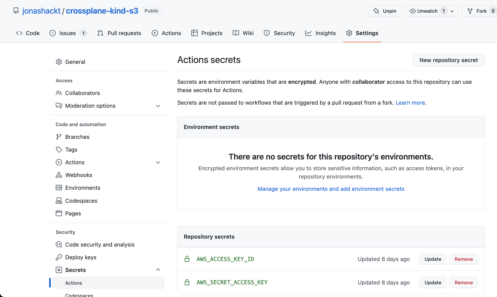

Also make sure to have your `Default region` configured locally - or as a `env:` variable in your CI system. All three needed variables [in GitHub Actions](.github/workflows/provision.yml) for example look like this:

```yaml
env:
  AWS_ACCESS_KEY_ID: ${{ secrets.AWS_ACCESS_KEY_ID }}
  AWS_SECRET_ACCESS_KEY: ${{ secrets.AWS_SECRET_ACCESS_KEY }}
  AWS_DEFAULT_REGION: 'eu-central-1'
```


### Create AWS Provider secret

Now we need to use the `aws-creds.conf` file to create the Crossplane AWS Provider secret:

```
kubectl create secret generic aws-creds -n crossplane-system --from-file=creds=./aws-creds.conf
```

If everything went well there should be a new `aws-creds` Secret ready:

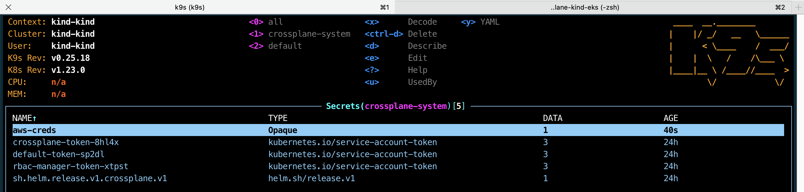


### Choosing a Crossplane AWS Provider

Currently there are two crossplane providers for AWS:

* https://github.com/crossplane-contrib/provider-aws (legacy now)
* https://github.com/upbound/provider-aws

The first is written "by hand" and supports around 193 Managed Resources and the other is generated using Upjet supporting the full AWS API with 924 Managed Resources. 

The second provider, which is also called the Upbound "official" provider has been donated to the OpenSource community in September 2023 - so there are now 2 OpenSource providers for AWS. 

Which one should you choose? [This issue clarifies it](https://github.com/crossplane-contrib/provider-aws/issues/1954#issuecomment-1862593913):

> "Upbound (the company behind crossplane) has moved to its own Terraform-based set of providers. This means that https://github.com/crossplane-contrib/provider-aws is now only maintained by community volunteers since there is a number of people out there who are still using it. __It is kind of legacy but it will receive further updates as long as the community is willing to contribute to it.__ 

Until June 2023 the Upbound providers had a problem. As Managed Resources are CRDs, the Upbound provider introduced a problem to most control planes, since Kubernetes wasn't designed for that amount of CRDs. I gave [a talk about crossplane at our local DevOps Meetup](https://www.meetup.com/de-DE/devopsthde/events/293211158/) and already struggled with the Upbound AWS provider.

Therefore in June 2023 the Upjet generated official Upbound provider has been split into Provider Families: https://blog.crossplane.io/crd-scaling-provider-families/ These split up Upbound providers are the way to go if you start using crossplane today:

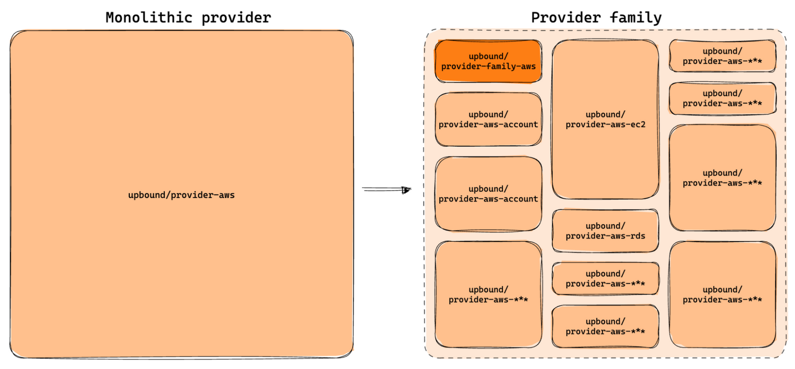

The [migration guide](https://docs.upbound.io/providers/migration/) also states that the monolithic provider is already deprecated:

> "Warning: The monolithic AWS provider (upbound/provider-aws) has been deprecated in favor of the AWS provider family. You can read more about the provider families in our blog post and the official documentation for the provider families is here. We will continue support for the monolithic AWS provider until June 12, 2024. https://marketplace.upbound.io/providers/upbound/provider-aws/"

So head over to [the Upbound marketplace](https://marketplace.upbound.io/) and search for your provider familiy. As we want to use AWS S3 for example, here we went with https://marketplace.upbound.io/providers/upbound/provider-aws-s3.


### Using the official Upbound (Upjet generated) AWS Provider

https://marketplace.upbound.io/providers/upbound/provider-aws-s3

Now before configuring the Upbound Provider, be sure to have the `aws-creds.conf` file in place and the provider secret created (as described in [Create aws-creds.conf file](#create-aws-credsconf-file) & [Create AWS Provider secret](#create-aws-provider-secret)):

```shell
kubectl create secret generic aws-creds -n crossplane-system --from-file=creds=./aws-creds.conf
```

With the secret in place we can install the Upbound AWS Provider. Therefore the [upbound/provider-aws-s3/config/provider-aws-s3.yaml](upbound/provider-aws-s3/config/provider-aws-s3.yaml) looks only slightly different compared to the classic AWS Provider - only the `spec.package` changed:

```yaml
apiVersion: pkg.crossplane.io/v1
kind: Provider
metadata:
  name: provider-aws-s3
spec:
  package: xpkg.upbound.io/upbound/provider-aws-s3:v0.46.0
  packagePullPolicy: Always
  revisionActivationPolicy: Automatic
  revisionHistoryLimit: 1
```

Install it via `kubectl`:


```shell
kubectl apply -f upbound/provider-aws-s3/config/provider-aws-s3.yaml
```

The `package` version in combination with the `packagePullPolicy` configuration here is crucial, since we can configure an update strategy for the Provider here. ~~I'am not sure, if the Crossplane team will provide an installation method where we can use tools like Renovate to keep our Crossplane providers up to date~~ (now Renovate supports Crossplane, see paragraph `Provider & Configuration Package Upgrades with Renovate`). A full table of all possible fields can be found in the docs: https://crossplane.io/docs/v1.8/concepts/packages.html#specpackagepullpolicy We can also let crossplane itself manage new versions for us. If you installed multiple package versions, you'll see them as `providerrevision.pkg.x` when running `kubectl get crossplane`:

```shell
$ kubectl get crossplane
...
NAME                                                           HEALTHY   REVISION   IMAGE                             STATE      DEP-FOUND   DEP-INSTALLED   AGE
providerrevision.pkg.crossplane.io/provider-aws-2189bc61e0bd   True      1          crossplanecontrib/provider-aws:v0.33.0   Inactive                               6d22h
providerrevision.pkg.crossplane.io/provider-aws-d87796863f95   True      2          crossplanecontrib/provider-aws:v0.34.0   Active                                 43h
...
```

Now our first Crossplane Provider has been installed. We need to wait for the Provider to become healthy:

```shell
kubectl wait "providers.pkg.crossplane.io/provider-aws-s3" --for=condition=Healthy --timeout=180s
```

Obtain the status via `kubectl get provider.pkg.crossplane.io`:

```shell
$ kubectl get provider.pkg.crossplane.io
NAME                          INSTALLED   HEALTHY   PACKAGE                                               AGE
provider-aws-s3               True        True      xpkg.upbound.io/upbound/provider-aws-s3:v0.46.0       113s
upbound-provider-family-aws   True        True      xpkg.upbound.io/upbound/provider-family-aws:v0.46.0   108s
```

Otherwise we may run into errors like this when applying the `ProviderConfig` right after the Provider.


### Create ProviderConfig to consume the Secret containing AWS credentials

To get our Provider finally working we also need to create a `ProviderConfig` accordingly that will tell the Provider where to find it's AWS credentials. Therefore we create a [upbound/provider-aws-s3/config/provider-config-aws.yaml](upbound/provider-aws-s3/config/provider-config-aws.yaml):

```yaml
apiVersion: aws.upbound.io/v1beta1
kind: ProviderConfig
metadata:
  name: default
spec:
  credentials:
    source: Secret
    secretRef:
      namespace: crossplane-system
      name: aws-creds
      key: creds
```

> Crossplane resources use the `ProviderConfig` named `default` if no specific ProviderConfig is specified, so this ProviderConfig will be the default for all AWS resources.

The `secretRef.name` and `secretRef.key` has to match the fields of the already created Secret.

Apply it via `kubectl`:


```shell
kubectl apply -f upbound/provider-aws-s3/config/provider-config-aws.yaml
```

Now we should have everything in place to use the Upbound AWS Provider! We can double check via `kubectl get crossplane`:

```shell
$ kubectl get crossplane
NAME                                    AGE
providerconfig.aws.upbound.io/default   55s

NAME                                                           HEALTHY   REVISION   IMAGE                                          STATE    DEP-FOUND   DEP-INSTALLED   AGE
providerrevision.pkg.crossplane.io/provider-aws-6acd9324f315   True      1          xpkg.upbound.io/upbound/provider-aws:v0.34.0   Active                               17m

NAME                                      INSTALLED   HEALTHY   PACKAGE                                        AGE
provider.pkg.crossplane.io/provider-aws   True        True      xpkg.upbound.io/upbound/provider-aws:v0.34.0   18m

NAME                                        AGE   TYPE         DEFAULT-SCOPE
storeconfig.secrets.crossplane.io/default   22h   Kubernetes   crossplane-system
```


Now we should have some more Kubernetes API resources available:

```shell
$ kubectl api-resources | grep aws
providerconfigs                                         aws.upbound.io/v1beta1                 false        ProviderConfig
providerconfigusages                                    aws.upbound.io/v1beta1                 false        ProviderConfigUsage
storeconfigs                                            aws.upbound.io/v1alpha1                false        StoreConfig
bucketaccelerateconfigurations                          s3.aws.upbound.io/v1beta1              false        BucketAccelerateConfiguration
bucketacls                                              s3.aws.upbound.io/v1beta1              false        BucketACL
bucketanalyticsconfigurations                           s3.aws.upbound.io/v1beta1              false        BucketAnalyticsConfiguration
bucketcorsconfigurations                                s3.aws.upbound.io/v1beta1              false        BucketCorsConfiguration
bucketintelligenttieringconfigurations                  s3.aws.upbound.io/v1beta1              false        BucketIntelligentTieringConfiguration
bucketinventories                                       s3.aws.upbound.io/v1beta1              false        BucketInventory
bucketlifecycleconfigurations                           s3.aws.upbound.io/v1beta1              false        BucketLifecycleConfiguration
bucketloggings                                          s3.aws.upbound.io/v1beta1              false        BucketLogging
bucketmetrics                                           s3.aws.upbound.io/v1beta1              false        BucketMetric
bucketnotifications                                     s3.aws.upbound.io/v1beta1              false        BucketNotification
bucketobjectlockconfigurations                          s3.aws.upbound.io/v1beta1              false        BucketObjectLockConfiguration
bucketobjects                                           s3.aws.upbound.io/v1beta1              false        BucketObject
bucketownershipcontrols                                 s3.aws.upbound.io/v1beta1              false        BucketOwnershipControls
bucketpolicies                                          s3.aws.upbound.io/v1beta1              false        BucketPolicy
bucketpublicaccessblocks                                s3.aws.upbound.io/v1beta1              false        BucketPublicAccessBlock
bucketreplicationconfigurations                         s3.aws.upbound.io/v1beta1              false        BucketReplicationConfiguration
bucketrequestpaymentconfigurations                      s3.aws.upbound.io/v1beta1              false        BucketRequestPaymentConfiguration
buckets                                                 s3.aws.upbound.io/v1beta1              false        Bucket
bucketserversideencryptionconfigurations                s3.aws.upbound.io/v1beta1              false        BucketServerSideEncryptionConfiguration
bucketversionings                                       s3.aws.upbound.io/v1beta1              false        BucketVersioning
bucketwebsiteconfigurations                             s3.aws.upbound.io/v1beta1              false        BucketWebsiteConfiguration
objectcopies                                            s3.aws.upbound.io/v1beta1              false        ObjectCopy
objects                                                 s3.aws.upbound.io/v1beta1              false        Object
```


# Provision a S3 Bucket with Crossplane

__The crossplane core Controller and the Provider AWS Controller should now be ready to provision any infrastructure component in AWS!__

You heard right: we don't create a Kubernetes based infrastructure component - but we start with a simple S3 Bucket.

Therefore we can have a look into the Crossplane AWS provider API docs:https://doc.crds.dev/github.com/upbound/provider-aws/s3.aws.upbound.io/Bucket/v1beta1@v0.45.0 


## Defining all Composite Resource components to provide an AWS EKS cluster

https://docs.crossplane.io/v1.14/concepts/composite-resource-definitions/

> A CompositeResourceDefinition (or XRD) defines the type and schema of your XR. It lets Crossplane know that you want a particular kind of XR to exist, and what fields that XR should have.

Since defining your own CompositeResourceDefinitions and Compositions is the main work todo with Crossplane, it's always good to know the full Reference documentation which can be found here https://docs.crossplane.io/v1.14/concepts/compositions/

One of the things to know is that Crossplane automatically injects some common 'machinery' into the manifests of the XRDs and Compositions: https://docs.crossplane.io/v1.14/concepts/composite-resources/


### Defining a CompositeResourceDefinition (XRD) for our S3 Bucket

All possible fields an XRD can have are documented here:

https://docs.crossplane.io/v1.14/concepts/composite-resource-definitions/

The field `spec.versions.schema` must contain a OpenAPI schema, which is similar to the ones used by any Kubernetes CRDs. They determine what fields the XR (and claim) will have. The full CRD documentation and a guide on how to write OpenAPI schemas could be found in the Kubernetes docs: https://kubernetes.io/docs/tasks/extend-kubernetes/custom-resources/custom-resource-definitions/

Note that Crossplane will be automatically extended this section. Therefore the following fields are used by Crossplane and will be ignored if they're found in the schema:

    spec.resourceRef
    spec.resourceRefs
    spec.claimRef
    spec.writeConnectionSecretToRef
    status.conditions
    status.connectionDetails


So our Composite Resource Definition (XRD) for our S3 Bucket could look like [crossplane-contrib/provider-aws/s3/definition.yaml](crossplane-contrib/provider-aws/s3/definition.yaml):

```yaml
---
apiVersion: apiextensions.crossplane.io/v1
kind: CompositeResourceDefinition
metadata:
  # XRDs must be named 'x<plural>.<group>'
  name: xobjectstorages.crossplane.jonashackt.io
spec:
  # This XRD defines an XR in the 'crossplane.jonashackt.io' API group.
  # The XR or Claim must use this group together with the spec.versions[0].name as it's apiVersion, like this:
  # 'crossplane.jonashackt.io/v1alpha1'
  group: crossplane.jonashackt.io
  
  # XR names should always be prefixed with an 'X'
  names:
    kind: XObjectStorage
    plural: xobjectstorages
  # This type of XR offers a claim, which should have the same name without the 'X' prefix
  claimNames:
    kind: ObjectStorage
    plural: objectstorages
  
  # default Composition when none is specified (must match metadata.name of a provided Composition)
  # e.g. in composition.yaml
  defaultCompositionRef:
    name: objectstorage-composition

  versions:
  - name: v1alpha1
    served: true
    referenceable: true
    # OpenAPI schema (like the one used by Kubernetes CRDs). Determines what fields
    # the XR (and claim) will have. Will be automatically extended by crossplane.
    # See https://kubernetes.io/docs/tasks/extend-kubernetes/custom-resources/custom-resource-definitions/
    # for full CRD documentation and guide on how to write OpenAPI schemas
    schema:
      openAPIV3Schema:
        type: object
        properties:
          spec:
            type: object
            # We define 2 needed parameters here one has to provide as XR or Claim spec.parameters
            properties:
              parameters:
                type: object
                properties:
                  bucketName:
                    type: string
                  region:
                    type: string
                required:
                  - bucketName
                  - region
```

Install the XRD into our cluster with:

```shell
kubectl apply -f crossplane-contrib/provider-aws/s3/definition.yaml
```

We can double check the CRDs beeing created with `kubectl get crds` and filter them using `grep` to our group name `crossplane.jonashackt.io`:

```shell
$ kubectl get crds | grep crossplane.jonashackt.io
objectstorages.crossplane.jonashackt.io                         2022-06-27T09:54:18Z
xobjectstorages.crossplane.jonashackt.io                        2022-06-27T09:54:18Z
```


### Craft a Composition to manage our needed cloud resources

The main work in Crossplane has to be done crafting the Compositions. This is because they interact with the infrastructure primitives the cloud provider APIs provide.

Detailled docs to many of the possible manifest configurations can be found here https://docs.crossplane.io/v1.14/concepts/compositions/


https://github.com/aws/aws-cdk/issues/25288#issuecomment-1522011311

https://doc.crds.dev/github.com/crossplane/provider-aws/s3.aws.crossplane.io/Bucket/v1beta1@v0.39.0

https://docs.aws.amazon.com/AmazonS3/latest/userguide/access-policy-language-overview.html

https://stackoverflow.com/questions/76097031/aws-s3-bucket-cannot-have-acls-set-with-objectownerships-bucketownerenforced-s 

https://marketplace.upbound.io/providers/upbound/provider-aws/v0.34.0/resources/s3.aws.upbound.io/BucketPublicAccessBlock/v1beta1 


According to https://github.com/hashicorp/terraform-provider-aws/issues/28353 and https://registry.terraform.io/providers/hashicorp/aws/latest/docs/resources/s3_bucket_acl we need to separate `Bucket` creation from `BucketPublicAccessBlock`, `BucketOwnershipControls` and `BucketACL` - which should now be available finally leveraging the Upbound AWS Provider:

```yaml
---
apiVersion: apiextensions.crossplane.io/v1
kind: Composition
metadata:
  name: objectstorage-composition
  labels:
    # An optional convention is to include a label of the XRD. This allows
    # easy discovery of compatible Compositions.
    crossplane.io/xrd: xobjectstorages.crossplane.jonashackt.io
    # The following label marks this Composition for AWS. This label can 
    # be used in 'compositionSelector' in an XR or Claim.
    provider: aws
spec:
  # Each Composition must declare that it is compatible with a particular type
  # of Composite Resource using its 'compositeTypeRef' field. The referenced
  # version must be marked 'referenceable' in the XRD that defines the XR.
  compositeTypeRef:
    apiVersion: crossplane.jonashackt.io/v1alpha1
    kind: XObjectStorage
  
  # When an XR is created in response to a claim Crossplane needs to know where
  # it should create the XR's connection secret. This is configured using the
  # 'writeConnectionSecretsToNamespace' field.
  writeConnectionSecretsToNamespace: crossplane-system
  
  # Each Composition must specify at least one composed resource template.
  resources:
    # Providing a unique name for each entry is good practice.
    # Only identifies the resources entry within the Composition. Required in future crossplane API versions.
    - name: bucket
      base:
        # see https://marketplace.upbound.io/providers/upbound/provider-aws/v0.34.0/resources/s3.aws.upbound.io/Bucket/v1beta1
        apiVersion: s3.aws.upbound.io/v1beta1
        kind: Bucket
        metadata: {}
        spec:
          deletionPolicy: Delete
      
      patches:
        - fromFieldPath: "spec.parameters.bucketName"
          toFieldPath: "metadata.name"
        - fromFieldPath: "spec.parameters.region"
          toFieldPath: "spec.forProvider.region"

    - name: bucketpublicaccessblock
      base:
        # see https://marketplace.upbound.io/providers/upbound/provider-aws/v0.34.0/resources/s3.aws.upbound.io/BucketPublicAccessBlock/v1beta1
        apiVersion: s3.aws.upbound.io/v1beta1
        kind: BucketPublicAccessBlock
        spec:
          forProvider:
            blockPublicAcls: false
            blockPublicPolicy: false
            ignorePublicAcls: false
            restrictPublicBuckets: false

      patches:
        - fromFieldPath: "spec.parameters.bucketPABName"
          toFieldPath: "metadata.name"
        - fromFieldPath: "spec.parameters.bucketName"
          toFieldPath: "spec.forProvider.bucketRef.name"
        - fromFieldPath: "spec.parameters.region"
          toFieldPath: "spec.forProvider.region"

    - name: bucketownershipcontrols
      base:
        # see https://marketplace.upbound.io/providers/upbound/provider-aws/v0.34.0/resources/s3.aws.upbound.io/BucketOwnershipControls/v1beta1#doc:spec-forProvider-rule-objectOwnership
        apiVersion: s3.aws.upbound.io/v1beta1
        kind: BucketOwnershipControls
        spec:
          forProvider:
            rule:
              - objectOwnership: ObjectWriter

      patches:
        - fromFieldPath: "spec.parameters.bucketOSCName"
          toFieldPath: "metadata.name"
        - fromFieldPath: "spec.parameters.bucketName"
          toFieldPath: "spec.forProvider.bucketRef.name"
        - fromFieldPath: "spec.parameters.region"
          toFieldPath: "spec.forProvider.region"

    - name: bucketacl
      base:
        # see https://marketplace.upbound.io/providers/upbound/provider-aws/v0.34.0/resources/s3.aws.upbound.io/BucketACL/v1beta1
        apiVersion: s3.aws.upbound.io/v1beta1
        kind: BucketACL
        spec:
          forProvider:
            acl: "public-read"

      patches:
        - fromFieldPath: "spec.parameters.bucketAclName"
          toFieldPath: "metadata.name"
        - fromFieldPath: "spec.parameters.bucketName"
          toFieldPath: "spec.forProvider.bucketRef.name"
        - fromFieldPath: "spec.parameters.region"
          toFieldPath: "spec.forProvider.region"
  
    - name: bucketwebsiteconfiguration
      base:
        # see https://marketplace.upbound.io/providers/upbound/provider-aws/v0.34.0/resources/s3.aws.upbound.io/BucketWebsiteConfiguration/v1beta1
        apiVersion: s3.aws.upbound.io/v1beta1
        kind: BucketWebsiteConfiguration
        spec:
          forProvider:
            indexDocument:
              - suffix: index.html

      patches:
        - fromFieldPath: "spec.parameters.bucketWebConfName"
          toFieldPath: "metadata.name"
        - fromFieldPath: "spec.parameters.bucketName"
          toFieldPath: "spec.forProvider.bucketRef.name"
        - fromFieldPath: "spec.parameters.region"
          toFieldPath: "spec.forProvider.region"

  # If you find yourself repeating patches a lot you can group them as a named
  # 'patch set' then use a PatchSet type patch to reference them.
  #patchSets:
```


Let's create Composition via:

```shell
kubectl apply -f upbound/provider-aws-s3/composition.yaml
```


### Craft a Composite Resource (XR) or Claim (XRC)

Crossplane could look quite intimidating when having a first look. There are few guides around to show how to approach a setup when using Crossplane the first time. You can choose between writing an XR __OR__ XRC! You don't need both, since the XR will be generated from the XRC, if you choose to craft a XRC.

https://docs.crossplane.io/v1.14/concepts/composite-resources/

Since we want to create a S3 Bucket, here's an suggestion for an [claim.yaml](crossplane-contrib/provider-aws/s3/claim.yaml):

```yaml
---
# Use the spec.group/spec.versions[0].name defined in the XRD
apiVersion: crossplane.jonashackt.io/v1alpha1
kind: ObjectStorage
metadata:
  # Only claims are namespaced, unlike XRs.
  namespace: default
  name: managed-s3
spec:
  # The compositionRef specifies which Composition this XR will use to compose
  # resources when it is created, updated, or deleted.
  compositionRef:
    name: objectstorage-composition
  
  # Parameters for the Composition to provide the Managed Resources (MR) with
  # to create the actual infrastructure components
  parameters:
    bucketName: microservice-ui-nuxt-js-static-bucket2
    region: eu-central-1
```


Testdrive with:

```shell
kubectl apply -f crossplane-contrib/provider-aws/s3/claim.yaml
```

When somthing goes wrong with the validation, this could look like this:

```shell
$ kubectl apply -f claim.yaml
error: error validating "claim.yaml": error validating data: [ValidationError(S3Bucket.metadata): unknown field "crossplane.io/external-name" in io.k8s.apimachinery.pkg.apis.meta.v1.ObjectMeta_v2, ValidationError(S3Bucket.spec): unknown field "parameters" in io.jonashackt.crossplane.v1alpha1.S3Bucket.spec, ValidationError(S3Bucket.spec.writeConnectionSecretToRef): missing required field "namespace" in io.jonashackt.crossplane.v1alpha1.S3Bucket.spec.writeConnectionSecretToRef, ValidationError(S3Bucket.spec): missing required field "bucketName" in io.jonashackt.crossplane.v1alpha1.S3Bucket.spec, ValidationError(S3Bucket.spec): missing required field "region" in io.jonashackt.crossplane.v1alpha1.S3Bucket.spec]; if you choose to ignore these errors, turn validation off with --validate=false
```

The Crossplane validation is a great way to debug your yaml configuration - it hints you to the actual problems that are still present.


### Troubleshooting your crossplane configuration

https://docs.crossplane.io/knowledge-base/guides/troubleshoot/

> Per Kubernetes convention, Crossplane keeps errors close to the place they happen. This means that if your claim is not becoming ready due to an issue with your Composition or with a composed resource you’ll need to “follow the references” to find out why. Your claim will only tell you that the XR is not yet ready.


The docs also tell us what they mean by "follow the references":

* Find your XR by running `kubectl describe <claim-kind> <claim-metadata.name>` and look for its “Resource Ref” (aka `spec.resourceRef`).
* Run `kubectl describe` on your XR. This is where you’ll find out about issues with the Composition you’re using, if any.
* If there are no issues but your XR doesn’t seem to be becoming ready, take a look for the “Resource Refs” (or `spec.resourceRefs`) to find your composed resources.
* Run `kubectl describe` on each referenced composed resource to determine whether it is ready and what issues, if any, it is encountering.


### Waiting for resources to become ready

There are some possible things to check while your resources (may) get deployed after running a `kubectl apply -f claim.yaml` (see https://crossplane.io/docs/v1.8/getting-started/provision-infrastructure.html#claim-your-infrastructure).

The best overview gives a `kubectl get crossplane` which will simply list all the crossplane resources:

```shell
$ kubectl get crossplane
Warning: Please use v1beta1 version of this resource that has identical schema.
NAME                                                                                          ESTABLISHED   OFFERED   AGE
compositeresourcedefinition.apiextensions.crossplane.io/xs3buckets.crossplane.jonashackt.io   True          True      23m

NAME                                               AGE
composition.apiextensions.crossplane.io/s3bucket   2d17h

NAME                                      INSTALLED   HEALTHY   PACKAGE                           AGE
provider.pkg.crossplane.io/provider-aws   True        True      crossplanecontrib/provider-aws:v0.34.0   4d21h

NAME                                                           HEALTHY   REVISION   IMAGE                             STATE    DEP-FOUND   DEP-INSTALLED   AGE
providerrevision.pkg.crossplane.io/provider-aws-2189bc61e0bd   True      1          crossplanecontrib/provider-aws:v0.34.0   Active                               4d21h

NAME                                        AGE     TYPE         DEFAULT-SCOPE
storeconfig.secrets.crossplane.io/default   5d23h   Kubernetes   crossplane-system
```

* `kubectl get claim`: get all resources of all claim kinds, like PostgreSQLInstance.
* `kubectl get composite`: get all resources that are of composite kind, like XPostgreSQLInstance.
* `kubectl get managed`: get all resources that represent a unit of external infrastructure.
* `kubectl get <name-of-provider>`: get all resources related to <provider>.
* `kubectl get crossplane`: get all resources related to Crossplane.


We can also check our claim with `kubectl get <claim-kind> <claim-metadata.name>` like this:

```shell
$ kubectl get ObjectStorage managed-s3
NAME         READY   CONNECTION-SECRET               AGE
managed-s3           managed-s3-connection-details   5s
```

To watch the provisioned resources become ready we can run `kubectl get crossplane -l crossplane.io/claim-name=<claim-metadata.name>`:

```shell
kubectl get crossplane -l crossplane.io/claim-name=managed-s3
```


Check if the S3 Bucket has been created successfully via aws CLI with `aws s3 ls | grep microservice-ui-nuxt-js-static-bucket2`.

```shell
$ aws s3 ls | grep microservice-ui-nuxt-js-static-bucket2
2022-06-27 11:56:26 microservice-ui-nuxt-js-static-bucket2
```

Our bucket should be there! We can also double check in the AWS console:

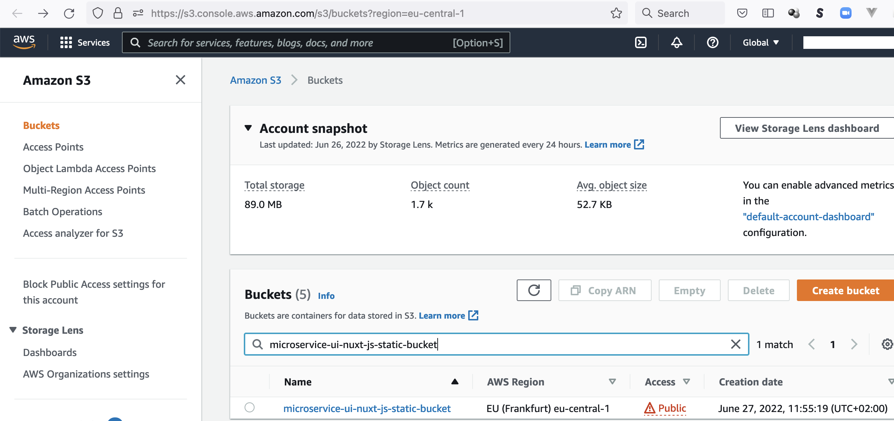


### Deploy our app

Let's deploy our app (a simple [index.html](static/index.html)) to our S3 Bucket using the aws CLI like this:

```shell
aws s3 sync static s3://devopsthde-bucket --acl public-read
```

Now we can open up http://microservice-ui-nuxt-js-static-bucket2.s3-website.eu-central-1.amazonaws.com/ in our Browser and should see our app beeing deployed:

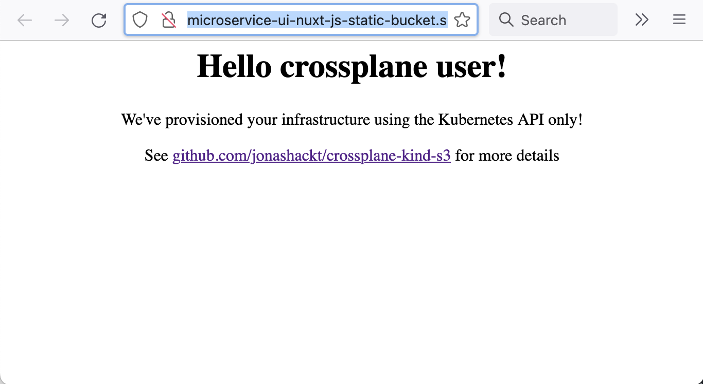


Before removing the claim, we should remove our `index.html` - otherwise we'll run into errors like this:

```shell
  Warning  CannotDeleteExternalResource  37s (x16 over 57s)  managed/bucket.s3.aws.crossplane.io  (combined from similar events): operation error S3: DeleteBucket, https response error StatusCode: 409, RequestID: 0WHR906YZRF0YDSH, HostID: x7cz2iYF/8Ag2wKtKRZUy1j3hPk67tBUOTFeR//+grrD7plqQ5Zo6EecO70KOOgHKbY7hUyp9vU=, api error BucketNotEmpty: The bucket you tried to delete is not empty
```

So first delete the `index.html`:

```shell
aws s3 rm s3://devopsthde-bucket/index.html
```

Finally remove our S3 Bucket again with 

```shell
kubectl delete -f upbound/provider-aws-s3/claim.yaml
```

Now also the S3 Bucket should be removed by crossplane.


# Configure Crossplane to access Azure

https://docs.crossplane.io/v1.14/getting-started/provider-azure/

https://marketplace.upbound.io/providers/upbound/provider-azure-storage/v0.39.0


### Create crossplane-azure-provider-key.json

https://docs.crossplane.io/latest/getting-started/provider-azure/#create-a-kubernetes-secret-for-azure

I assume here that you have [azure CLI installed](https://docs.microsoft.com/en-us/cli/azure/install-azure-cli) and you're logged in to your Azure subscription via `az login`. So that the command `az account show` should work on your system.

> The current Crossplane docs on Azure propose a `az ad sp create-for-rbac` command that isn't working: `ERROR: Usage error: To create role assignments, specify both --role and --scopes.` When using `--role` we must use `--scopes` also. The documentation about the latter isn't easy to grasp https://docs.microsoft.com/en-us/cli/azure/ad/sp?view=azure-cli-latest#az-ad-sp-create-for-rbac at first sight. As there are examples like `--scopes /subscriptions/{subscriptionId}/resourceGroups/{resourceGroup1}` I thought I need to create a resourceGroup before even connecting to Azure to create a resourceGroup with Crossplane (that doesn't make any sense). BUT: It's possible to use `--scopes /subscriptions/{subscriptionId}` here without any resourceGroups, which will create a scope for your whole subscription.

So prepare the `SUBSCRIPTION_ID` variable like this:

```shell
export SUBSCRIPTION_ID=$(az account show --query id --output tsv)
```

With this prepared we can create a service principal in Azure AD using the following command:

```shell
az ad sp create-for-rbac --sdk-auth --role Owner --scopes /subscriptions/$SUBSCRIPTION_ID --name servicePrincipalCrossplaneGHActions > crossplane-azure-provider-key.json
```

> Although this produces a waring message like `WARNING: Option '--sdk-auth' has been deprecated and will be removed in a future release.` we definitely need to use the `--sdk-auth` parameter. Otherwise our Managed Resources will run into errors like `connect failed: cannot get authorizer from client credentials config: failed to get SPT from client credentials: parameter 'activeDirectoryEndpoint' cannot be empty` because there are configuration entries missing in the file like `"activeDirectoryEndpointUrl": "https://login.microsoftonline.com",`.

This produces a `crossplane-azure-provider-key.json` file you should never ever check into version control! For this repository I added it to the [.gitignore](.gitignore) file. 


If you're using a CI system like GitHub Actions (as this repository is based on), define 3 repository secrets from the output. Choose the `appId` as the `ARM_CLIENT_ID`, the `password` as the `ARM_CLIENT_SECRET` and the `tenant` as the `ARM_TENANT_ID`. Additionally we need to define the `ARM_SUBSCRIPTION_ID` secret. Therefore run a `az account show` (after you logged your CLI into your Azure subscription via `azure login`) and use the value of `"id":`.

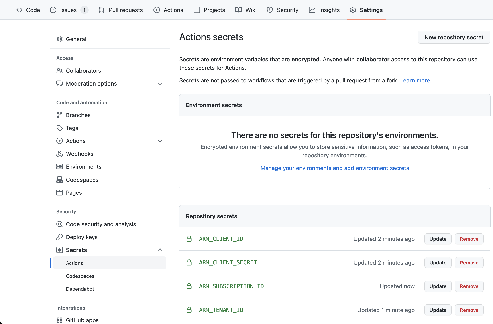

On GitHub Actions we need to 

```shell
echo "{
  \"clientId\": \"$ARM_CLIENT_ID\",
  \"clientSecret\": \"$ARM_CLIENT_SECRET\",
  \"subscriptionId\": \"$ARM_SUBSCRIPTION_ID\",
  \"tenantId\": \"$ARM_TENANT_ID\",
  \"activeDirectoryEndpointUrl\": \"https://login.microsoftonline.com\",
  \"resourceManagerEndpointUrl\": \"https://management.azure.com/\",
  \"activeDirectoryGraphResourceId\": \"https://graph.windows.net/\",
  \"sqlManagementEndpointUrl\": \"https://management.core.windows.net:8443/\",
  \"galleryEndpointUrl\": \"https://gallery.azure.com/\",
  \"managementEndpointUrl\": \"https://management.core.windows.net/\"
}" > crossplane-azure-provider-key.json
```


All three needed variables [in GitHub Actions](.github/workflows/provision-azure.yml) for example look like this:

```yaml
env:
  ARM_CLIENT_ID: ${{ secrets.ARM_CLIENT_ID }}
  ARM_CLIENT_SECRET: ${{ secrets.ARM_CLIENT_SECRET }}
  ARM_SUBSCRIPTION_ID: ${{ secrets.ARM_SUBSCRIPTION_ID }}
  ARM_TENANT_ID: ${{ secrets.ARM_TENANT_ID }}
```


### Create Azure Provider secret

Now we need to use the `crossplane-azure-provider-key.json` file to create the Crossplane Azure Provider secret:

```shell
kubectl create secret generic azure-account-creds -n crossplane-system --from-file=creds=./crossplane-azure-provider-key.json
```

If everything went well there should be a new `azure-account-creds` Secret ready.


### Install the Crossplane Azure Provider

https://docs.crossplane.io/latest/getting-started/provider-azure/#install-the-azure-provider

Let's create a [provider-azure-storage.yaml](upbound/provider-azure-storage/config/provider-azure-storage.yaml) file like this:

```yaml
apiVersion: pkg.crossplane.io/v1
kind: Provider
metadata:
  name: provider-azure-storage
spec:
  package: xpkg.upbound.io/upbound/provider-azure-storage:v0.39.0
  packagePullPolicy: Always
  revisionActivationPolicy: Automatic
  revisionHistoryLimit: 1
```

Install the Azure provider:

```shell
kubectl apply -f upbound/provider-azure-storage/config/provider-azure-storage.yaml
```

Now our first Crossplane Provider has been installed. You may check it with `kubectl get provider`:

```shell
$ kubectl get provider
NAME             INSTALLED   HEALTHY   PACKAGE                            AGE
provider-azure   True        Unknown   crossplane/provider-azure:v0.19.0  13s
```

Before we can actually apply a `ProviderConfig` to our Azure provider we have to make sure that it's actually healthy and running. Therefore we can use the `kubectl wait` command like this:

```shell
kubectl wait --for=condition=healthy --timeout=120s provider/provider-azure
```

Otherwise we may run into errors like this when applying the `ProviderConfig` right after the Provider.


### Create ProviderConfig to consume the Secret containing Azure credentials

https://docs.crossplane.io/latest/getting-started/provider-azure/#create-a-providerconfig

Now we need to create `ProviderConfig` object that will tell the AWS Provider where to find it's AWS credentials. Therefore we create a [provider-config-azure.yaml](crossplane-contrib/provider-azure/config/provider-config-azure.yaml):

```yaml
apiVersion: azure.upbound.io/v1beta1
kind: ProviderConfig
metadata:
  name: default
spec:
  credentials:
    source: Secret
    secretRef:
      namespace: crossplane-system
      name: azure-account-creds
      key: creds
```

> Crossplane resources use the `ProviderConfig` named `default` if no specific ProviderConfig is specified, so this ProviderConfig will be the default for all Azure resources.

The `secretRef.name` and `secretRef.key` has to match the fields of the already created Secret.

Apply it with:

```shell
kubectl apply -f upbound/provider-azure-storage/config/provider-config-azure.yaml
```

__The crossplane core Controller and the Provider Azure Controller should now be ready to provision any infrastructure component in Azure!__


# Provision a StorageAccount in Azure with Crossplane

https://doc.crds.dev/github.com/upbound/provider-azure/storage.azure.upbound.io/Account/v1beta1@v0.38.2

https://doc.crds.dev/github.com/upbound/provider-azure/azure.upbound.io/ResourceGroup/v1beta1@v0.38.2


### Defining a CompositeResourceDefinition (XRD) for our Storage Account

So our Composite Resource Definition (XRD) for our Storage Account could look like [upbound/provider-azure-storage/definition.yaml](upbound/provider-azure-storage/definition.yaml):

```yaml
---
apiVersion: apiextensions.crossplane.io/v1
kind: CompositeResourceDefinition
metadata:
  name: xstoragesazure.crossplane.jonashackt.io
spec:
  group: crossplane.jonashackt.io
  names:
    kind: XStorageAzure
    plural: xstoragesazure
  claimNames:
    kind: StorageAzure
    plural: storagesazure
  
  defaultCompositionRef:
    name: storageazure-composition

  versions:
  - name: v1alpha1
    served: true
    referenceable: true
    # See https://kubernetes.io/docs/tasks/extend-kubernetes/custom-resources/custom-resource-definitions/
    schema:
      openAPIV3Schema:
        type: object
        properties:
          spec:
            type: object
            properties:
              parameters:
                type: object
                properties:
                  location:
                    type: string
                  resourceGroupName:
                    type: string
                  storageAccountName:
                    type: string
                required:
                  - location
                  - resourceGroupName
                  - storageAccountName
```

Install the XRD into our cluster with:

```shell
kubectl apply -f upbound/provider-azure-storage/definition.yaml
```

Let's wait for the XRD to become `Offered`:

```shell
kubectl wait --for=condition=Offered --timeout=120s xrd xstoragesazure.crossplane.jonashackt.io  
```


### Craft a Composition to manage our needed cloud resources

A Composite to manage an Storage Account in Azure with public access for static website hosting could for example look like this [upbound/provider-azure-storage/composition.yaml](upbound/provider-azure-storage/composition.yaml):

```yaml
---
apiVersion: apiextensions.crossplane.io/v1
kind: Composition
metadata:
  name: storageazure-composition
  labels:
    crossplane.io/xrd: xstoragesazure.crossplane.jonashackt.io
    provider: azure
spec:
  compositeTypeRef:
    apiVersion: crossplane.jonashackt.io/v1alpha1
    kind: XStorageAzure
  
  writeConnectionSecretsToNamespace: crossplane-system
  
  resources:
    - name: storageaccount
      base:
        # see https://doc.crds.dev/github.com/crossplane/provider-azure/storage.azure.crossplane.io/Account/v1alpha3@v0.19.0
        apiVersion: storage.azure.upbound.io/v1beta1
        kind: Account
        metadata: {}
        spec:
          forProvider:
            accountKind: StorageV2
            accountTier: Standard
            accountReplicationType: LRS
      patches:
        - fromFieldPath: spec.parameters.storageAccountName
          toFieldPath: metadata.name
        - fromFieldPath: spec.parameters.resourceGroupName
          toFieldPath: spec.forProvider.resourceGroupName
        - fromFieldPath: spec.parameters.location
          toFieldPath: spec.forProvider.location
          
    - name: resourcegroup
      base:
        # see https://doc.crds.dev/github.com/crossplane/provider-azure/azure.crossplane.io/ResourceGroup/v1alpha3@v0.19.0
        apiVersion: azure.upbound.io/v1beta1
        kind: ResourceGroup
        metadata: {}
      patches:
        - fromFieldPath: spec.parameters.resourceGroupName
          toFieldPath: metadata.name
        - fromFieldPath: spec.parameters.location
          toFieldPath: spec.forProvider.location
```

Install our Composition with 

```shell
kubectl apply -f upbound/provider-azure-storage/composition.yaml
```


### Craft a Composite Resource (XR) or Claim (XRC)

Since we want to create a Storage Account, here's an suggestion for an [claim.yaml](upbound/provider-azure-storage/claim.yaml):

```yaml
---
apiVersion: crossplane.jonashackt.io/v1alpha1
kind: StorageAzure
metadata:
  namespace: default
  name: managed-storage-account
spec:
  compositionRef:
    name: storageazure-composition
  parameters:
    location: West Europe
    resourceGroupName: rg-crossplane
    storageAccountName: account4c8672f
```


Testdrive with 

```shell
kubectl apply -f upbound/provider-azure-storage/claim.yaml
```


### Wait for the Azure ResourceGroup & Storage Account to become ready

We can use the new `trace` command of the [`crossplane` CLI introduced in 1.14](https://blog.crossplane.io/crossplane-v1-14/) to have a look, what's going on with our Azure resources:

```shell
$ crossplane beta trace storageazure.crossplane.jonashackt.io/managed-storage-account
NAME                                SYNCED   READY   STATUS                                                                                
StorageAzure/account (default)      True     False   Waiting: ...resource claim is waiting for composite resource to become Ready          
└─ XStorageAzure/account-g97s8      False    -       ReconcileError: ... "object": spec.forProvider.accountTier is a required parameter]   
   ├─ Account/account4c8672f        -        -       Error: accounts.storage.azure.upbound.io "account4c8672f" not found                   
   └─ ResourceGroup/rg-crossplane   -        -       Error: resourcegroups.azure.upbound.io "rg-crossplane" not found    
```

Ahh, so our Composition isn't crafted correctly. 

To fix this, we need to have a look into the API docs at https://doc.crds.dev/github.com/upbound/provider-azure/storage.azure.upbound.io/Account/v1beta1@v0.38.2. After fixing our Composition and reapplying it together with the Claim, we can have a look into the Azure Portal. Our Resource Group should show up:

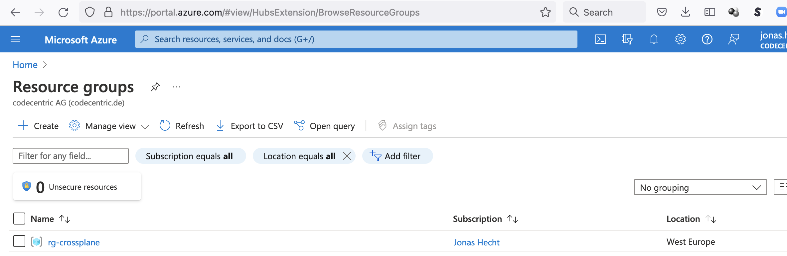

And also our Storage account should be visible inside the group:

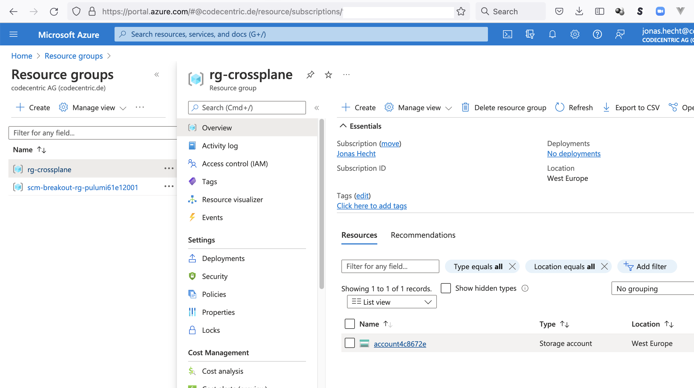


# TODO:


## Publish Crossplane Configuration Package into GitHub Container Registry

Let's package our Composite Resource definitions as a Configuration. Therefore we need to use the Crossplane CLI via <code>kubectl crossplane build configuration</code> (now they are a Package) - and push them to an OCI registry via <code>kubectl crossplane push configuration</code>. With this Configurations can also be easily installed into other Crossplane clusters.

Therefore we need a `crossplane.yaml` file as described in https://crossplane.io/docs/v1.8/getting-started/create-configuration.html#build-and-push-the-configuration 

See also https://crossplane.io/docs/v1.8/concepts/packages.html#configuration-packages

Our [crossplane-contrib/provider-aws/s3/crossplane.yaml](crossplane-contrib/provider-aws/s3/crossplane.yaml) is of `kind: Configuration` and defines the minimum crossplane version needed alongside the crossplane AWS provider:

```yaml
apiVersion: meta.pkg.crossplane.io/v1
kind: Configuration
metadata:
  name: s3-bucket-composition
spec:
  crossplane:
    version: ">=v1.8"
  dependsOn:
    - provider: crossplanecontrib/provider-aws
      version: ">=v0.33.0"
```

Having this `crossplane.yaml` in place we can build our Configuration at last. On a command line go into the directory where the `crossplane.yaml` resides and run the `kubectl crossplane build` command:

```shell
$ cd crossplane-s3
$ kubectl crossplane build configuration
```


Really strange, getting

```shell
kubectl crossplane build configuration
kubectl crossplane: error: failed to build package: failed to parse package: {path:/Users/jonashecht/dev/kubernetes/crossplane-awws-azure/crossplane-contrib/provider-aws/s3/composition.yaml position:0}: no kind "S3Bucket" is registered for version "crossplane.jonashackt.io/v1alpha1" in scheme "/home/runner/work/crossplane/crossplane/internal/xpkg/scheme.go:47"
```


# Provision an EKS cluster with crossplane

__The crossplane core Controller and the Provider AWS Controller should now be ready to provision any infrastructure component in AWS!__

So in order to maximise the Inception let's provision an EKS based Kubernetes cluster in AWS with our crossplane Kubernetes cluster :) 

A EKS cluster is a complex AWS construct leveraging different basic AWS services. That's exactly what a crossplane Composite Resource (XR) is all about. So let's create our own Composite Resource.


## Higher level abstractions - or why it is so hard to write your own Compositions

Looking only at the Crossplane docs and blog I thought something is missing: A curated library of higher level abstractions (like Pulumi Crosswalk). First initiatives from cloud vendors like AWS Blueprints for Crossplane: https://aws.amazon.com/blogs/opensource/introducing-aws-blueprints-for-crossplane/

But then I found the Upbound blog - and finally stumbled upon the __Upbound Platform Reference Architectures__ https://blog.upbound.io/azure-reference-platform/ which are intended as

> foundations to help accelerate understanding and application of Crossplane within your organization


### Use Upbound Platform Reference Architecture AWS to provision a EKS cluster

__What I didn't wanted to do is to duplicate some code__ into my `Composition` from all those sources I found (mainly this https://www.kloia.com/blog/production-ready-eks-cluster-with-crossplane, this https://aws.amazon.com/blogs/containers/gitops-model-for-provisioning-and-bootstrapping-amazon-eks-clusters-using-crossplane-and-argo-cd/ and https://aws.amazon.com/blogs/opensource/introducing-aws-blueprints-for-crossplane/) about provisioning a EKS cluster with crossplane. 


### Install platform-ref-aws

https://github.com/upbound/platform-ref-aws#install-the-platform-configuration


### The problem with Open Source Crossplane: Provider Coverage Problem

See this blog post https://blog.upbound.io/first-official-providers/ and the paragraph `Provider Coverage Problem`:

> The Crossplane community has been adding CustomResourceDefinitions (CRDs) to cover the API surface, but the pace is unable to catch up with users who are blocked from getting into production with Crossplane due to the lack of coverage. To give you an idea, AWS has ~1000 resources and the classic AWS provider has yet to cover ~200 as of writing.

Now with the classic AWS provider https://marketplace.upbound.io/providers/crossplane-contrib/provider-aws/v0.39.0/crds you have around 180 CRDs available. If you only need the CRDs that are provided by this classic provider, everything is okay. But I recently stumbled upon a new security default implementation of AWS S3: https://github.com/jonashackt/crossplane-aws-azure/issues/12

This project stopped to work, simply since AWS doesn't support Access Control Lists (ACLs) for all new S3 Buckets anymore. See https://github.com/hashicorp/terraform-provider-aws/issues/28353

> Starting in April 2023, Amazon S3 will introduce two new default bucket security settings by automatically enabling S3 Block Public Access and disabling S3 access control lists (ACLs) for all new S3 buckets.

This in fact means, that we not only need the `Bucket` CRD, but we additionally need `BucketACL`, `BucketPublicAccessBlock` and `BucketOwnershipControls`, which are only available in the so called official Upbound providers with their 901 CRDs: https://marketplace.upbound.io/providers/upbound/provider-aws/v0.34.0/crds


Up until now I didn't really know the difference between the classic providers and the official providers. But the official providers are based on the tool Upjet https://github.com/upbound/upjet/ which is the successor of the former Terrajet https://github.com/crossplane/terrajet, where Terraform modules are used to generate Crossplane CRDs. With this approach, every API Terraform provides is also available in Crossplane. Upjet is currently used to generate all CRDs for the official AWS, Azure and GCP providers.

And with Upjet it's possible to generate really any Crossplane provider from Terraform, meaning one can rely on every Provider Terraform already has: https://registry.terraform.io/browse/providers

Why not use Terraform then you may ask. Theres a good post here https://blog.crossplane.io/crossplane-vs-terraform/ which makes the point, that Terraform can only be used from a bash script - but Crossplane delivers a control plane based approach, which continously reconciles all infrastructure configured inside of it.

So TLDR: To fix the error https://github.com/jonashackt/crossplane-aws-azure/issues/12

```shell
S3 creation error: CannotCreateExternalResource managed/bucket.s3.aws.crossplane.io failed to create the Bucket: InvalidBucketAclWithObjectOwnership: Bucket cannot have ACLs set with ObjectOwnership's BucketOwnerEnforced setting
```

we need to switch over to the official AWS provider based on Upjet. Do we need to use the UXP (Universal Control Plane) flavour of Crossplane for that? No, the docs https://marketplace.upbound.io/providers/upbound/provider-aws/v0.34.0/docs/configuration state:

> The Upbound AWS official provider may also be used with upstream Crossplane.

So let's use the provider inside our project!


### IDE plugins

https://blog.upbound.io/moving-crossplane-package-authoring-from-plain-yaml-to-ide-aided-development/

Upbound VS Code plugin https://blog.upbound.io/crossplane-vscode-plugin-announcement/

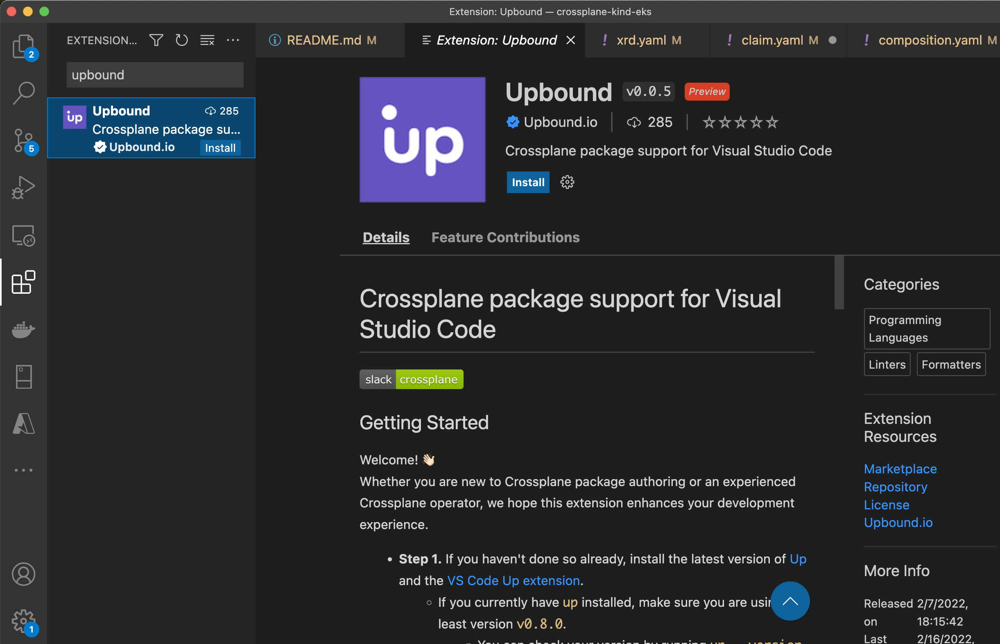


# Links

https://crossplane.io/

Intro post https://medium.com/@khelge/crossplane-7197ad200013

Crossplane is based on OAM (3 roles: Developer, application operator & infrastructure operator) https://github.com/oam-dev/spec

https://www.kloia.com/blog/production-ready-eks-cluster-with-crossplane

https://www.forbes.com/sites/janakirammsv/2021/09/15/how-crossplane-transforms-kubernetes-into-a-universal-control-plane/

> Crossplane essentially transforms Kubernetes into a universal control plane that can orchestrate the lifecycle of public cloud-based services such as virtual machines, database instances, Big Data clusters, machine learning jobs, and other managed services offered by the hyperscalers. 

> Crossplane takes the concept of Infrastructure as Code (IaC) to the next level through its tight integration with Kubernetes.

Intro Slides: https://docs.google.com/presentation/d/1PxZweRpB6HElxd9qGK1McboGZ1kluCDCS5qxgYnX5f0/edit#slide=id.g8801599ecb_2_169


Promoted from sandbox to incubation by the CNCF: https://blog.crossplane.io/crossplane-cncf-incubation/ 

Crossplane vs. Terraform: https://blog.crossplane.io/crossplane-vs-terraform/

Crossplane 101 https://vrelevant.net/crossplane-bringing-the-basics-together/


https://www.techtarget.com/searchitoperations/news/252508176/Crossplane-project-could-disrupt-infrastructure-as-code


Argo + crossplane https://morningspace.medium.com/using-crossplane-in-gitops-what-to-check-in-git-76c08a5ff0c4


Infrastructure-as-Apps https://codefresh.io/blog/infrastructure-as-apps-the-gitops-future-of-infra-as-code/


New Charter from Sep 2023 on: https://github.com/crossplane/crossplane/pull/4643 Developer Experience and Providers are added to the scope of crossplane

Even Upjet and the major Upbound developed (aka Upjet generated) Providers are donated to the OS project & CNCF: https://blog.crossplane.io/charter-expansion-upjet-donation/

See also https://github.com/crossplane-contrib/provider-aws/issues/1954


### Crossplane + AWS

https://aws.amazon.com/blogs/containers/gitops-model-for-provisioning-and-bootstrapping-amazon-eks-clusters-using-crossplane-and-argo-cd/

> Crossplane’s infrastructure provider for AWS relies on code generated by the AWS Go Code Generator, which is also used by [AWS Controllers for Kubernetes (ACK)](https://github.com/aws-controllers-k8s/community). 

https://www.kloia.com/blog/production-ready-eks-cluster-with-crossplane


AWS Blueprints for Crossplane: 

https://aws.amazon.com/blogs/opensource/introducing-aws-blueprints-for-crossplane/

> Writing your first Composition and debugging can be intimidating.

And it's quite a doublicate effort IMHO compared to other tools like Pulumi that provide higher level abstractions including well-architectured best practices (like Pulumi https://www.pulumi.com/docs/guides/crosswalk/aws/)

https://github.com/aws-samples/crossplane-aws-blueprints


Thoughworks Tech Radar: Assess https://www.thoughtworks.com/de-de/radar/tools/crossplane


IONOS and crossplane https://docs.ionos.com/crossplane-provider/example


### CRD examples

https://github.com/upbound/platform-ref-s3-website


### Show status of infrastructure components

k8s event-log! `:events` and then scroll down to the newest events and have a (constant) look


### Composition Updates

https://docs.crossplane.io/knowledge-base/guides/composition-revisions/

> If you have 10 PlatformDB XRs all using the big-platform-db Composition, all 10 of those XRs will be instantly updated in accordance with any updates you make to the big-platform-db Composition.

So if we change a Composition, all the XRs will be updated - which we can see in the Kubernetes Events:

>[](screenshots/update-composition-updates-external-resources.png)

But be aware of this error:

```shell
cannot compose resources: cannot parse base template of composed resource "securitygrouprule-cluster-inbound": cannot change the kind or group of a composed resource from ec2.aws.upbound .io/v1beta1, Kind=SecurityGroupRule to ec2.aws.upbound.io/v1beta1, Kind=SecurityGroupIngressRule (possible composed resource template mismatch) 
```

See https://github.com/crossplane/crossplane/issues/1909


If you don't want Composition updates, use:


### Composition Revisions

https://docs.crossplane.io/knowledge-base/guides/composition-revisions/

Self-service via XRs - and a platform team, that manages the Composition:

> Usually, in the interest of self-service, the Composition is managed by a different team from the actual PlatformDB XRs. For example the Composition may be written and maintained by a platform team member, while individual application teams create PlatformDB XRs that use said Composition.

> Composition Revisions allow XRs to opt out of automatic updates.


### Troubleshooting

https://docs.crossplane.io/knowledge-base/guides/troubleshoot/


### Crossplane CRD Validation

##### Install crossplane CLI

https://github.com/crossplane/crossplane/releases/tag/v1.15.0

> Enhancements to the Crossplane CLI: New subcommands like `crossplane beta validate` for schema validation, `crossplane beta top` for resource utilization views similar to `kubectl top pods`, and `crossplane beta convert` for converting resources to newer formats or configurations.

Install crossplane CLI:

```shell
curl -sL "https://raw.githubusercontent.com/crossplane/crossplane/master/install.sh" |sh
```

If that produces an error, try to manually craft the download link:

```shell
curl -sfLo crossplane "https://releases.crossplane.io/stable/v1.15.0/bin/linux_amd64/crank"
sudo mv crossplane /usr/local/bin
```

Be sure to have the `v1.15.0` version installed as a minimum, otherwise the `crossplane beta validate` command won't work:

```shell
crossplane --version
v1.15.0
```

### Validate XR or Claim against Composite Resource Definition

Before using the command have a look at the command reference: https://docs.crossplane.io/latest/cli/command-reference/#beta-validate:

> The crossplane beta validate command validates compositions against provider or XRD schemas using the Kubernetes API server’s validation library.

So let's grab a `definition.yaml` and validate a `claim.yaml` against it:

```shell
crossplane beta validate --cache-dir ~/.crossplane definition.yaml claim.yaml
[✓] crossplane.jonashackt.io/v1alpha1, Kind=ObjectStorage, managed-upbound-s3 validated successfully
Total 1 resources: 0 missing schemas, 1 success cases, 0 failure cases
```

To prevent the command from polluting our projects with `.crossplane` directories, we should also provide a `--cache-dir ~/.crossplane` flag, which will deposit the directory in the user profile folder.


### Validate Managed Resources against a Crossplane provider (family)

We need to provide the provider's schemes.

For example grab a Composition and validate it against the AWS provider:

```shell
crossplane beta validate --cache-dir ~/.crossplane config/provider-aws-s3.yaml resources/bucket.yaml
package schemas does not exist, downloading:  xpkg.upbound.io/upbound/provider-aws-s3:v1.1.0
[✓] s3.aws.upbound.io/v1beta1, Kind=Bucket, crossplane-argocd-s3-bucket validated successfully
[✓] s3.aws.upbound.io/v1beta1, Kind=BucketPublicAccessBlock, crossplane-argocd-s3-bucket-pab validated successfully
[✓] s3.aws.upbound.io/v1beta1, Kind=BucketOwnershipControls, crossplane-argocd-s3-bucket-osc validated successfully
[✓] s3.aws.upbound.io/v1beta1, Kind=BucketACL, crossplane-argocd-s3-bucket-acl validated successfully
[✓] s3.aws.upbound.io/v1beta1, Kind=BucketWebsiteConfiguration, crossplane-argocd-s3-bucket-websiteconf validated successfully
Total 5 resources: 0 missing schemas, 5 success cases, 0 failure cases
```


##### Validate a full directory against XRDs or Provider schema

We can also validate a full directory:

```shell
crossplane beta validate --cache-dir ~/.crossplane provider-aws-s3/definition.yaml provider-aws-s3
[✓] crossplane.jonashackt.io/v1alpha1, Kind=ObjectStorage, managed-upbound-s3 validated successfully
[!] could not find CRD/XRD for: apiextensions.crossplane.io/v1, Kind=Composition
[!] could not find CRD/XRD for: pkg.crossplane.io/v1, Kind=Provider
[!] could not find CRD/XRD for: aws.upbound.io/v1beta1, Kind=ProviderConfig
[!] could not find CRD/XRD for: apiextensions.crossplane.io/v1, Kind=CompositeResourceDefinition
[✓] s3.aws.upbound.io/v1beta1, Kind=Bucket, crossplane-argocd-s3-bucket validated successfully
[✓] s3.aws.upbound.io/v1beta1, Kind=BucketPublicAccessBlock, crossplane-argocd-s3-bucket-pab validated successfully
[✓] s3.aws.upbound.io/v1beta1, Kind=BucketOwnershipControls, crossplane-argocd-s3-bucket-osc validated successfully
[✓] s3.aws.upbound.io/v1beta1, Kind=BucketACL, crossplane-argocd-s3-bucket-acl validated successfully
[✓] s3.aws.upbound.io/v1beta1, Kind=BucketWebsiteConfiguration, crossplane-argocd-s3-bucket-websiteconf validated successfully
Total 10 resources: 4 missing schemas, 6 success cases, 0 failure cases
```


```shell
crossplane beta validate --cache-dir ~/.crossplane provider-aws-s3/config/provider-aws-s3.yaml provider-aws-s3
[!] could not find CRD/XRD for: crossplane.jonashackt.io/v1alpha1, Kind=ObjectStorage
[!] could not find CRD/XRD for: apiextensions.crossplane.io/v1, Kind=Composition
[!] could not find CRD/XRD for: pkg.crossplane.io/v1, Kind=Provider
[!] could not find CRD/XRD for: aws.upbound.io/v1beta1, Kind=ProviderConfig
[!] could not find CRD/XRD for: apiextensions.crossplane.io/v1, Kind=CompositeResourceDefinition
[✓] s3.aws.upbound.io/v1beta1, Kind=Bucket, crossplane-argocd-s3-bucket validated successfully
[✓] s3.aws.upbound.io/v1beta1, Kind=BucketPublicAccessBlock, crossplane-argocd-s3-bucket-pab validated successfully
[✓] s3.aws.upbound.io/v1beta1, Kind=BucketOwnershipControls, crossplane-argocd-s3-bucket-osc validated successfully
[✓] s3.aws.upbound.io/v1beta1, Kind=BucketACL, crossplane-argocd-s3-bucket-acl validated successfully
[✓] s3.aws.upbound.io/v1beta1, Kind=BucketWebsiteConfiguration, crossplane-argocd-s3-bucket-websiteconf validated successfully
Total 10 resources: 5 missing schemas, 5 success cases, 0 failure cases
```


##### beta render: kind of Unit tests

https://docs.crossplane.io/latest/cli/command-reference/#beta-render

https://blog.crossplane.io/building-crossplane-composition-functions-to-empower-your-control-plane/


##### Composition Validation

To be able to validate Compositions & XRs, we need another command in the game: `crossplane beta render`:

https://docs.crossplane.io/latest/cli/command-reference/#validate-render-command-output

> You can pipe the output of `crossplane beta render` into `crossplane beta validate` to validate complete Crossplane resource pipelines, including XRs, compositions and composition functions.

Therefore we need to use the `--include-full-xr` command with `crossplane beta render` and the `-` option with `crossplane beta validate` like that:

```shell
crossplane beta render composition.yaml --include-full-xr | crossplane beta validate config/provider-aws-s3.yaml -
```


### Provider Upgrades

Imagine a provider beeing configured like this:

```yaml
apiVersion: pkg.crossplane.io/v1
kind: Provider
metadata:
  name: provider-aws-ec2
spec:
  package: xpkg.upbound.io/upbound/provider-aws-ec2:v1.1.0
  packagePullPolicy: Always
  revisionActivationPolicy: Automatic
  revisionHistoryLimit: 1
```

Now if `provider-aws-ec2:v1.1.1` gets released, the `revisionActivationPolicy: Automatic` will lead to a automatically upgraded provider.

This can be great - or it can lead to a sitation, where the new provider version doesn't work as expected (e.g. because it presents a https://docs.crossplane.io/latest/concepts/providers/#unhealthypackagerevision) - and thus beeing rolled back, also automatically. This could lead to a situation, where the provider gets unusable from time to time.

If we want to do Provider upgrades in a GitOps fashion through a git commit to a git repository, we should configure the `packagePullPolicy` to `IfNotPresent` instead of `Always` (which means " Check for new packages every minute and download any matching package that isn’t in the cache", see https://docs.crossplane.io/master/concepts/packages/#configuration-package-pull-policy) - BUT leave the `revisionActivationPolicy` to `Automatic`! Since otherwise, the Provider will never get active and healty! See https://docs.crossplane.io/master/concepts/packages/#revision-activation-policy), but I didn't find it documented that way!

```yaml
apiVersion: pkg.crossplane.io/v1
kind: Provider
metadata:
  name: provider-aws-ec2
spec:
  package: xpkg.upbound.io/upbound/provider-aws-ec2:v1.1.0
  packagePullPolicy: IfNotPresent # Only download the package if it isn’t in the cache.
  revisionActivationPolicy: Automatic # Otherwise our Provider never gets activate & healthy
  revisionHistoryLimit: 1
```

#### Provider & Configuration Package Upgrades with Renovate

Renovate supports Crossplane by the end of November 2023:

* https://github.com/renovatebot/renovate/discussions/22363
* merged PR https://github.com/renovatebot/renovate/pull/25911 & docs https://github.com/renovatebot/renovate/pull/25911/commits/d224eaeaee0283282d54bc86e2b7f3e7100de455

The Renovate docs tell us how we can configure Crossplane support:

https://docs.renovatebot.com/modules/manager/crossplane/

> To use the crossplane manager you must set your own fileMatch pattern. The crossplane manager has no default fileMatch pattern, because there is no common filename or directory name convention for Crossplane YAML files. The crossplane manager supports these depTypes: configuration, function, provider

So we always need to explicitely configure Renovate to let it handle our Crossplane Provider & Configuration Package updates for us!

The simplest configuration would be:

```yaml
"crossplane": {
    "fileMatch": ["\\.yaml$"]
  }
```

It makes sense, if most of the files are for Crossplane.


### Readiness checks

https://docs.crossplane.io/latest/concepts/compositions/#resource-readiness-checks

https://docs.crossplane.io/latest/concepts/compositions/#match-a-boolean


### End-2-End tests 

With `uptest` and `kuttl`:

https://github.com/upbound/platform-ref-s3-website/blob/main/Makefile


### How does Patching work?

https://github.com/awslabs/crossplane-on-eks?tab=readme-ov-file#features

https://github.com/awslabs/crossplane-on-eks/blob/main/doc/patching-101.md


### Stacks now called Packages

https://github.com/crossplane/crossplane/blob/master/design/design-doc-composition.md

>  Note that Crossplane packages were formerly known as 'Stacks'. This term has been rescoped to refer specifically to a package of infrastructure configuration but is frequently synonymous with packages in historical design documents and some remaining Crossplane APIs.


## Others

#### KUTTL - KUbernetes Test TooL

https://kuttl.dev/

example: https://github.com/jonashackt/crossplane-kuttl


# GitHub Actions recommendations

A good advice is to use unique bucket names based on the branch to prevent interfering jobs with each other. Otherwise a Renovate enabled Crossplane project using real Cloud resources will create multiple crashed jobs in a row. 

But we also need to split out the branch name, see https://stackoverflow.com/a/73467112/4964553
otherwise we'll run into errors like: 

```shell
compose resources: cannot associate composed resources with Composition resource templates: cannot get composed resource: invalid resource name "spring2024-bucket-renovate/xpkg.upbound.io-upbound-provider-aws-s3-1.x": [may not contain '/']'
```

Therefore I created a `BUCKET_NAME` variable and ` Split branch name` step which uses the predefined `{{ github.ref_name }}' containing the branch name with often with a slash (when they are opened by Renovate for example):

```yaml
name: provision-aws

on: [push]

env:
  KIND_NODE_VERSION: v1.29.2
  BUCKET_NAME: spring2024-bucket
  # AWS
  AWS_ACCESS_KEY_ID: ${{ secrets.AWS_ACCESS_KEY_ID }}
  AWS_SECRET_ACCESS_KEY: ${{ secrets.AWS_SECRET_ACCESS_KEY }}
  AWS_DEFAULT_REGION: 'eu-central-1'

jobs:
  crossplane-provision-aws:
    runs-on: ubuntu-latest
    steps:
      - name: Checkout
        uses: actions/checkout@master

      # Using branch unique name for our bucket to prevent interfering jobs
      # But we need to split out the branch name, see https://stackoverflow.com/a/73467112/4964553
      # otherwise we'll run into errors like: 'compose resources: cannot associate composed resources with Composition resource templates: cannot get composed resource: invalid resource name "spring2024-bucket-renovate/xpkg.upbound.io-upbound-provider-aws-s3-1.x": [may not contain '/']'
      - name: Split branch name
        env:
          BRANCH: ${{ github.ref_name }}
        id: split
        run: echo "::set-output name=branchbucketsuffix::${BRANCH##*/}"
```

Later I create a inline Claim instead of using the yaml file to be able to override the bucket name dynamically:

```yaml
      # Not using kubectl apply -f upbound/provider-aws-s3/claim.yaml currently to prevent jobs from interfering with each other
      - name: Create XRD, Composition & Claim to create S3 Bucket (now using Upbound official AWS Provider Families)
        run: |
          ...

          echo "### Create Claim, which should create S3 Bucket (inline here to prevent jobs from interfering with each other)"
          kubectl apply -f - <<EOF
          apiVersion: crossplane.jonashackt.io/v1alpha1
          kind: ObjectStorage
          metadata:
            namespace: default
            name: managed-upbound-s3
          spec:
            compositionRef:
              name: objectstorage-composition
            parameters:
              bucketName: "$BUCKET_NAME-${{ steps.split.outputs.branchbucketsuffix }}"
              region: eu-central-1
          EOF

          ...
```

Now in AWS console we can watch Renovate doing it's work without interfering with other branches:

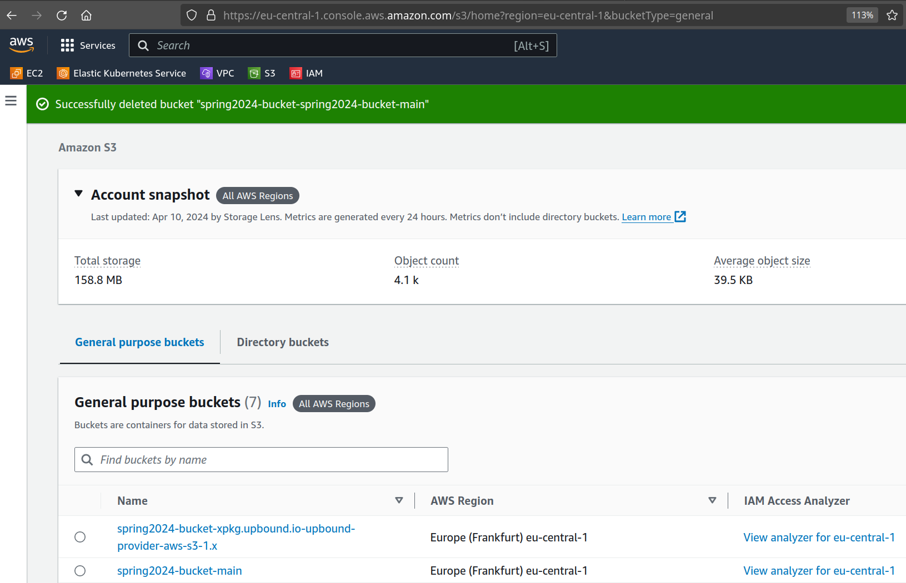


And finally we need to use the bucket name also when we interact with AWS S3:

```yaml
      - name: Upload index.html to S3 and check deployment works
        run: |
          echo "### Upload index.html to Bucket via AWS CLI"
          aws s3 sync static "s3://$BUCKET_NAME-${{ steps.split.outputs.branchbucketsuffix }}" --acl public-read

          echo "### Access S3 Bucket static website"
          curl "http://$BUCKET_NAME-${{ steps.split.outputs.branchbucketsuffix }}.s3-website.eu-central-1.amazonaws.com"

      - name: Delete index.html and remove Claim for S3 Bucket deletion
        run: |
          echo "### Delete index.html from S3 Bucket"
          aws s3 rm "s3://$BUCKET_NAME-${{ steps.split.outputs.branchbucketsuffix }}/index.html"

          ...
```